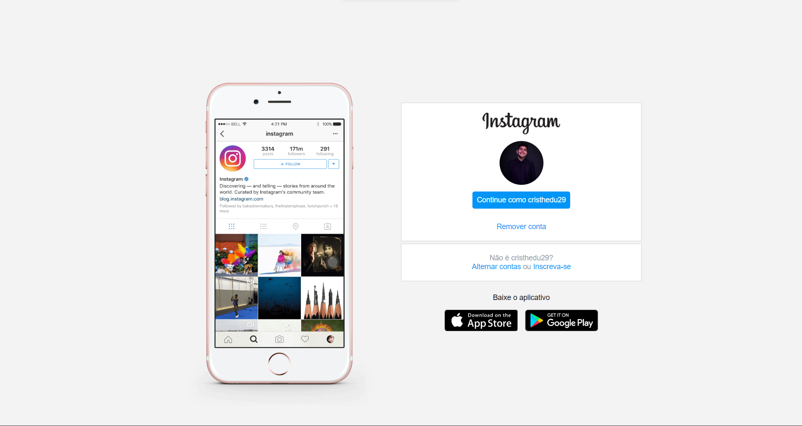
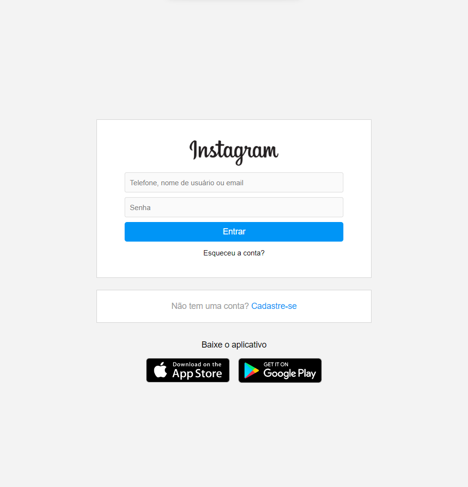
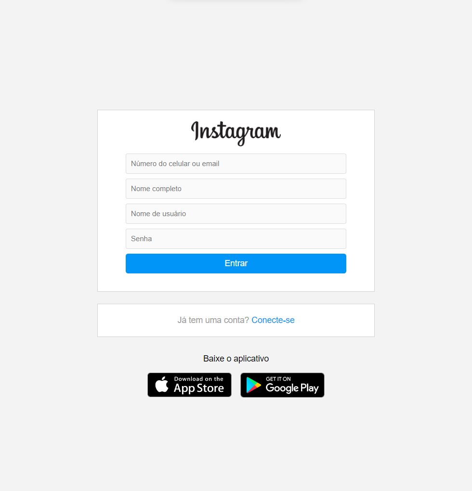

# 🚀 Recriando a página inicial do Instagram

Nesse projeto tive o desafio de reconstruir a página de login do Instagram. Para isso, foi recomendado o uso de CSS com Flexbox, uma das abordagens de posicionamento de elementos mais utilizadas quando se trata de responsividade. Além disso, a expert disponibilizou todo o código fonte em seu GitHub, a partir dele eu desenvolvi as demais telas.

### A Tela Inicial(disponíbilizada no código fonte) foi:

## 🚀 Let's code! 🚀

### As telas inicialmente desenvolvidas foram as telas de Conectar e Cadastrar:

    
    

